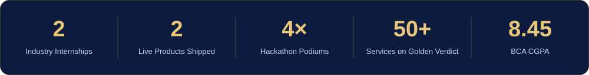
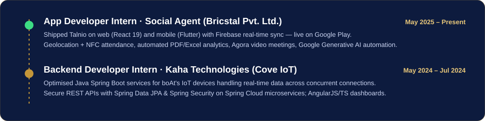
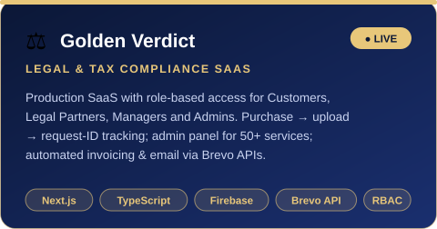
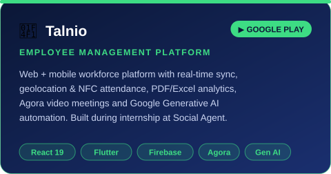
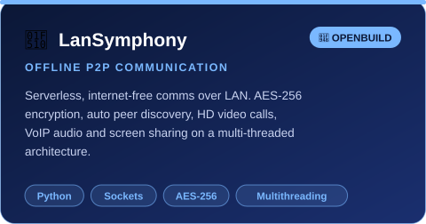
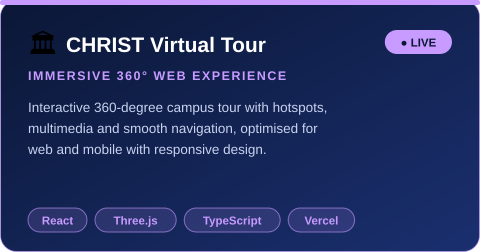
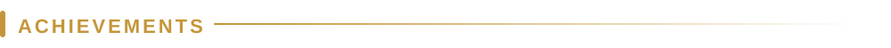
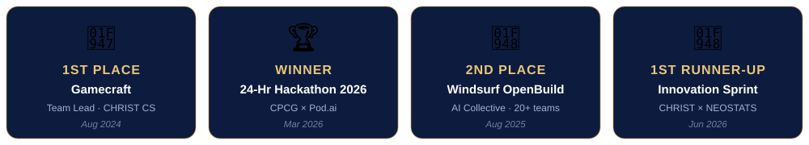

<!-- ════════════════════════════  HEADER  ════════════════════════════ -->
<a href="https://linkedin.com/in/vishalbg">
  
</a>

<p align="center">
  <a href="https://linkedin.com/in/vishalbg">
    
  </a>
</p>

<p align="center">
  <a href="https://linkedin.com/in/vishalbg"></a>
  <a href="mailto:vishalbg02@gmail.com"></a>
  <a href="https://goldenverdict.com"></a>
  
</p>



<!-- ════════════════════════════  ABOUT  ════════════════════════════ -->


<table>
<tr>
<td width="55%" valign="top">

I'm an **MCA student at CHRIST University, Bengaluru** who loves turning ideas into software people actually use.

- 📱 Built **Talnio** (web + mobile) — **live on Google Play**
- ⚖️ Built & deployed **Golden Verdict**, a live legal-tech SaaS
- ⚙️ Wrote **Java Spring Boot** services & REST APIs for **boAt** IoT devices
- 🤖 Integrating **Generative AI APIs**; exploring RAG & function calling
- 🏆 **4× hackathon podium** finisher, 🥇 team lead at Gamecraft
- 🎯 Looking for **SDE / Full Stack** roles

</td>
<td width="45%" valign="top">

```java
public class Vishal extends Developer {
    String role     = "Full Stack Developer";
    String studying = "MCA @ CHRIST University";
    String[] backend  = {"Java", "Spring Boot", "SQL"};
    String[] frontend = {"React", "Next.js", "TS"};
    String[] mobile   = {"Flutter", "React Native"};
    String[] ai       = {"GenAI APIs", "RAG"};

    @Override
    public String motto() {
        return "Ship it. Measure it. Improve it.";
    }
}
```

</td>
</tr>
</table>

<!-- ════════════════════════════  EXPERIENCE  ════════════════════════════ -->




<!-- ════════════════════════════  PROJECTS  ════════════════════════════ -->


<table>
<tr>
<td width="50%"><a href="https://goldenverdict.com"></a></td>
<td width="50%"></td>
</tr>
<tr>
<td width="50%"></td>
<td width="50%"><a href="https://virtual-tour-opal.vercel.app"></a></td>
</tr>
</table>

<!-- ════════════════════════════  ACHIEVEMENTS  ════════════════════════════ -->




<p align="center">
  🛠️ <b>Core Committee — Technical Team, GATEWAYS 2026</b> · built the official fest app in React Native
  &nbsp;|&nbsp; 🎮 Launched <b>CosmoStrike</b>, our Gamecraft-winning space game
</p>

<p align="center">
  
  
  
</p>

<!-- ════════════════════════════  TECH STACK  ════════════════════════════ -->


<table align="center">
<tr><td align="center"><b>Languages</b></td><td></td></tr>
<tr><td align="center"><b>Backend</b></td><td></td></tr>
<tr><td align="center"><b>Frontend</b></td><td></td></tr>
<tr><td align="center"><b>Mobile</b></td><td> &nbsp;</td></tr>
<tr><td align="center"><b>Cloud & Tools</b></td><td></td></tr>
</table>

<p align="center"><b>Also:</b> REST API & Function Integration · Microservices · RBAC · Spring Security · RAG Fundamentals · Agile</p>

<!-- ════════════════════════════  GITHUB ACTIVITY  ════════════════════════════ -->


<p align="center">
  
</p>

<picture>
  <source media="(prefers-color-scheme: dark)" srcset="https://raw.githubusercontent.com/vishalbg02/vishalbg02/output/github-snake-dark.svg" />
  <source media="(prefers-color-scheme: light)" srcset="https://raw.githubusercontent.com/vishalbg02/vishalbg02/output/github-snake.svg" />
  
</picture>

<!-- ════════════════════════════  CONNECT  ════════════════════════════ -->


<p align="center">
  Open to <b>SDE / Full Stack Developer</b> opportunities, collaborations and hackathon teams.<br/>
  <a href="https://linkedin.com/in/vishalbg"></a>
  <a href="mailto:vishalbg02@gmail.com"></a>
</p>


